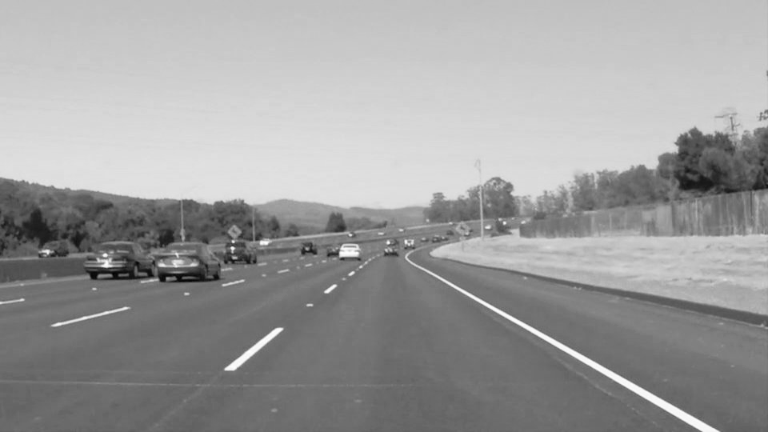
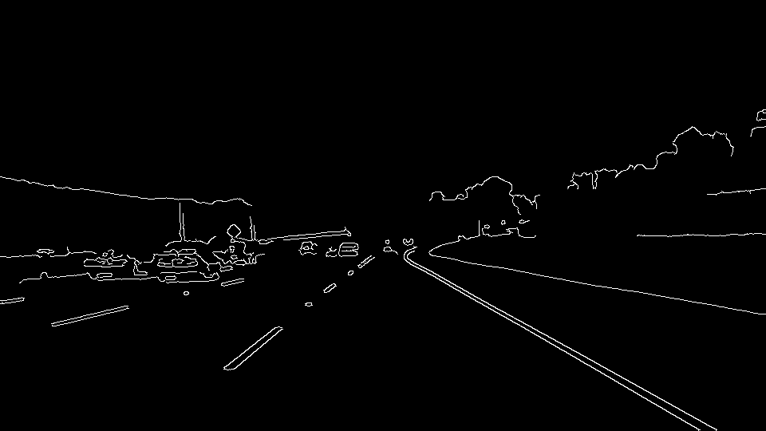
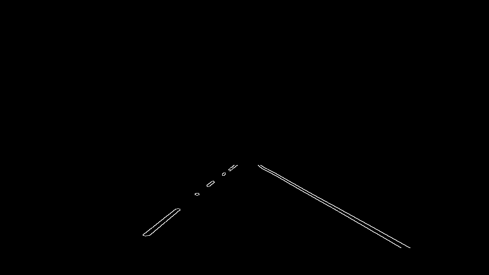
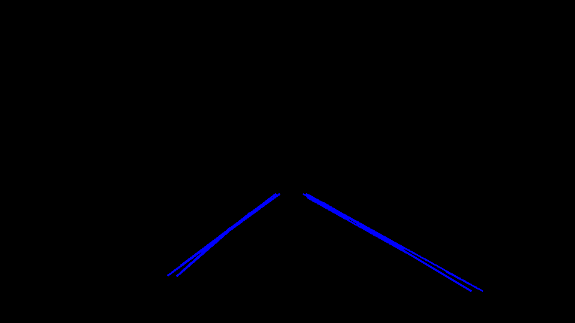
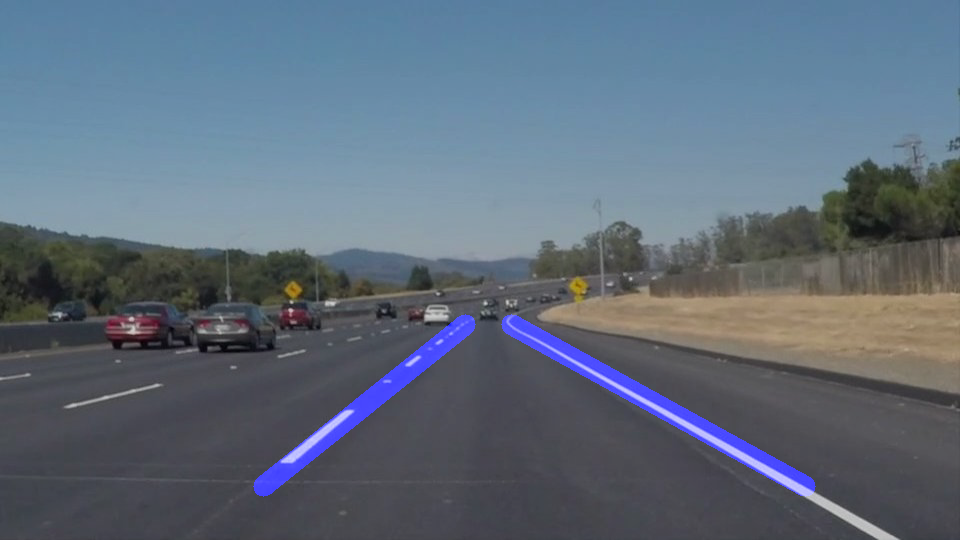

#**Finding Lane Lines on the Road**

##Writeup Template

###You can use this file as a template for your writeup if you want to submit it as a markdown file. But feel free to use some other method and submit a pdf if you prefer.

---

**Finding Lane Lines on the Road**

The goals / steps of this project are the following:
* Make a pipeline that finds lane lines on the road
* Reflect on your work in a written report

[//]: # (Image References)

[image1]: ./examples/grayscale.jpg "Grayscale"

---

### Reflection

### 1. Describe your pipeline. As part of the description, explain how you modified the draw_lines() function.

I wrote everything inside _core_ function to applied the whole pipeline to an image. It started by converting the image to grayscale followed by a Gaussian blur to smooth over the image.

Grayscale

After that, I ran Canny edge detection and applied a mask to the Canny edges. This must be done after the detection, otherwise the extremities of the mask would show up as edges in the detection output.

Cany Edge Detection

Masked Cany Edge Detection

The Hough transform was applied on the masked edges. The output lines that had an angle below 25deg to the horizontal axis
were filtered out. This was important mostly for the challenge video, since there were portions of the road with different colors and there would be horizontal lines.

Hough transform lines

Afterwards, I splitted lines into left and right lanes and computed the top and bottom points for each side. So, if I had 5 lines belonging to the left, I'd get the point of any line that was closer to the top and the same for the bottom. This allowed me to have a single lane marking.

For the final output I just drawed the two final lines into the input image.

Final image

### 2. Potential shortcomings and  possible improvements

My first problem when I tried the challenge was that my polygon mask had hardcoded pixel locations. In practical terms, this means that if we change to cameras with different resolution but with the same view point, the algorithm would not perform. I changed my pipeline to apply the mask relative to the image size.

The other issue is that one of the road types is very light and the gradient between the left yellow line and the road itself is not sufficient for an edge to be detected. Since there are no edges on the left lane marking, Hough does not output any lines there. One solution is to play with the Canny Edge Detector parameters. I changed the low threshold to 20, which helped but caused the overall performance to be more "jumpy". This requires further fine tuning.

Another problem with this approach is that the road must be relatively straight. If the car would find a sharp curve, this pipeline would not work well at all. One solution would be to use an alternative to the currently used Hough transform to find more complex shapes.

Finally, imagine a situation where there would be some litter on the road. Its size is big enough that we get a Hough line for it and its slope is such that it is not filtered out but far away enough from the lane to throw off the slope of the final line. A solution to this would be to go from a line that jus uses the extreme points of the lines in each lane to one where we use all the lines. Possibly, even tring to use a higher order polynomial from the different lines to get a more fitted line to the road or even a weighted approach depending on the caracteristics of each line.
